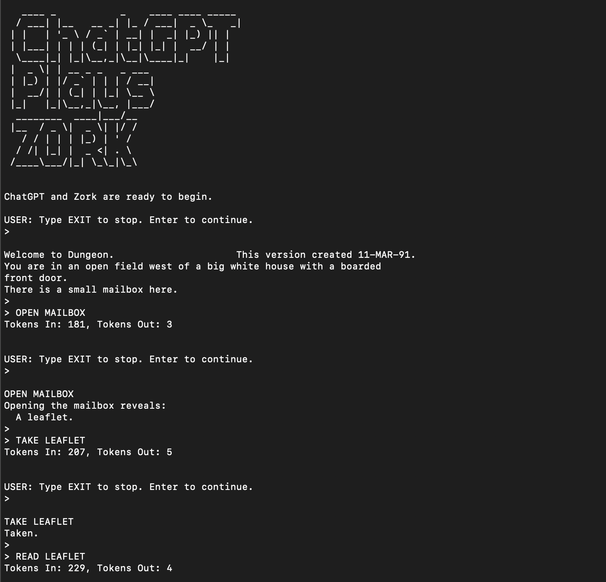
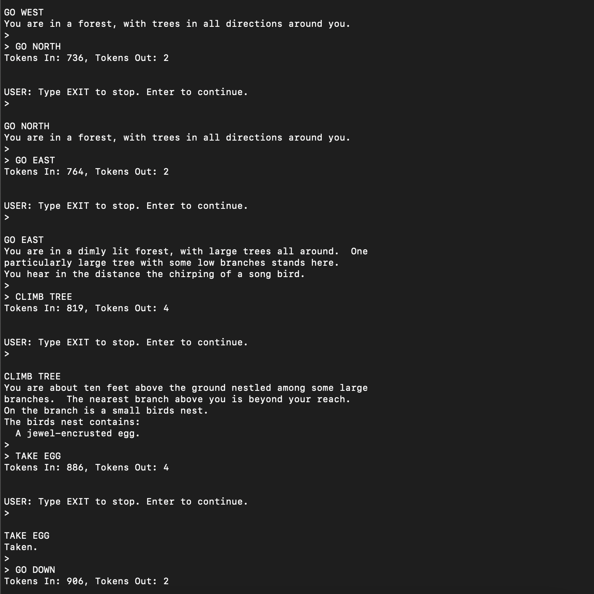

[](https://github.com/psf/black)
[](https://github.com/psf/black/blob/main/LICENSE)

# ChatGPT Plays Zork

```
   ____ _           _    ____ ____ _____ 
  / ___| |__   __ _| |_ / ___|  _ \_   _|
 | |   | '_ \ / _` | __| |  _| |_) || |  
 | |___| | | | (_| | |_| |_| |  __/ | |  
  \____|_| |_|\__,_|\__|\____|_|    |_|  
 |  _ \| | __ _ _   _ ___                
 | |_) | |/ _` | | | / __|               
 |  __/| | (_| | |_| \__ \               
 |_|   |_|\__,_|\__, |___/               
  ________  ____|___/__                  
 |__  / _ \|  _ \| |/ /                  
   / / | | | |_) | ' /                   
  / /| |_| |  _ <| . \                   
 /____\___/|_| \_\_|\_\                  
                                         
``` 
##### Let ChatGPT take a break and have some fun; it can now play Zork on your computer.

## <sub> What is it?

* Another command line tool for the [OpenAI API - Docs](https://platform.openai.com/docs/introduction).
* Allows ChatGPT to play through the classic game [Zork](https://en.wikipedia.org/wiki/Zork).
* It will try its best to play through the game. You can continue or stop the game at each step in execution.




## <sub> How to install.

* Install the latest version of [Python 3](https://www.python.org/downloads).
* Install the OpenAI [Python package](https://pypi.org/project/openai).
* Install [pexpect](https://pypi.org/project/pexpect) to control the Zork process. 
* Clone the repo.
* Zork can be installed in a number of ways and it depends on your system.
  * Easy [brew install](https://formulae.brew.sh/formula/zork) for Mac ([source](https://github.com/devshane/zork)).
  * Infocom downloads of [Zork I, II, III](http://www.infocom-if.org/downloads/downloads.html) are also available and free.
  * Info for [compiling on OS X](https://web.archive.org/web/20090912085627/http://www.macosxhints.com/article.php?story=20010407020830755) from source.

## <sub> How to use.

* Add your OpenAI API key to <b>config.ini</b>.
* Ensure Zork command in <b>config.ini</b> is correct or update it for your specific install.
  * If Installed on Mac with brew link from above it will work with the default.
* python3 chatgpt_plays_zork.py
  * Run default application.
* python3 chatgpt_plays_zork.py -h
  * Display help message.
* python3 chatgpt_plays_zork.py -m "gpt-4"
  * Use model "gpt-4".
